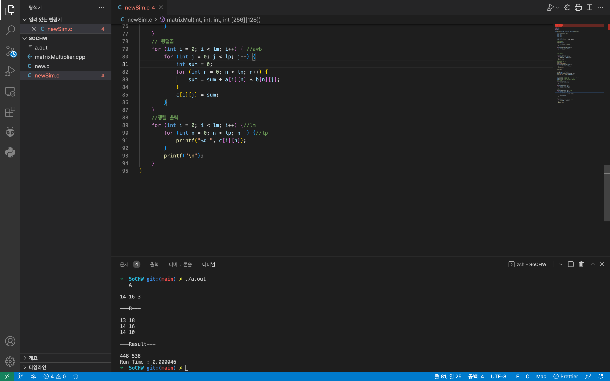
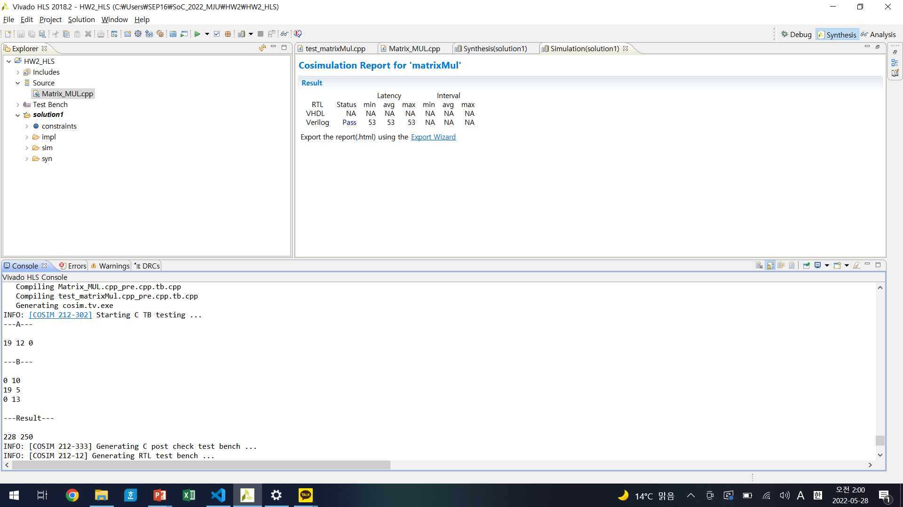
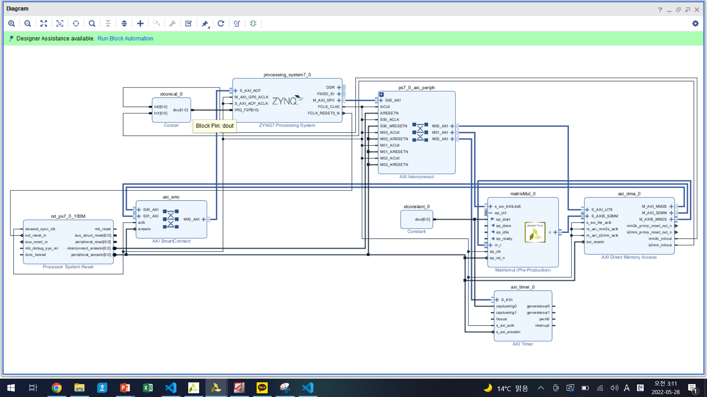
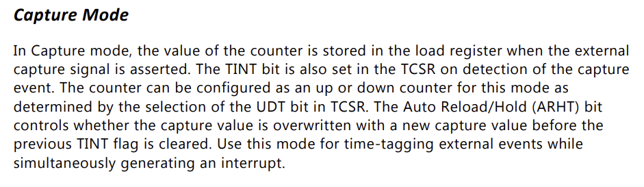
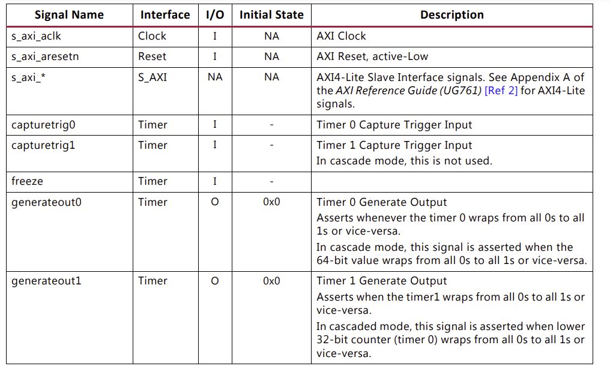
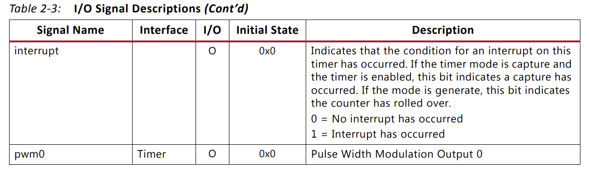
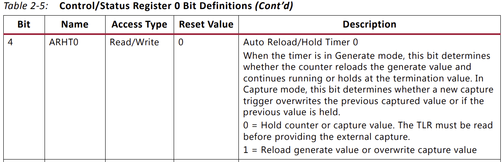

# 1번 커밋
* 고정 메모리이지만, 원하는 사이즈 만큼만 계산가능한 매트릭스 연산코드를 작성하였다.
* 나름 HLS에 잘 붙게 신경 써주었지만 아래와 같은 문제가 있었다.
* 여러 함수가 호출하는 구조라 HLS가 포트를 내야하는 부분을 잡지를 못한다.
* 그래서 C코드를 수정하기로 했다

# 2번 커밋
* C 코드를 대폭 수정하였다.
* 배열 초기화 하는 과정은 SDK에서 수행할 예정이다.
* HLS로 넘기는 코드는 정말 행렬연산 만한다.

# 3번 커밋
* HLS 돌림.
* vivado에서 IP등록함

# 4번커밋
* AXI TIMER 외 블록디자인 과정중 아래의 문제가 발생하였다.
* DMA의 MM2S포트가 2개 뿐인것 하나는 PS랑 물려서 하나의 포트만 남는다.
* 문제는 내가 만든 IP는 MM2S를 2개 요구한다.
* Custom ip를 수정하기로 했다.
* 일단 기본적으로 단위행렬에다가 필요한 부분에 만 값을 대입하고 IP로 날린다. 128*128 끼리 연산하고 PS에서 필요한 부분을 짤라서 뿌리기로함,

# 5번커밋
* 
C로 만 sim한 결과 계산 잘나옴
* 
    cosim 돌려도 계산 잘나옴

# 6번 커밋
* Syntesis : LM.LN.LP (AXI lite slave) In,c (AXI Stream)
* RTL Export

# 7번 커밋
* 
* 블록디자인을 구성해주었다
* 
* 
* 
* 일단은 Capture Trig에 Active High가 뜨면 Pause하게 코드를 짤 생각입니다.
* 
* Capture mode, this bit determines whether a new capturetrigger overwrites the previous captured value or if the previous value is held.

  0 = Hold counter or capture value. The TLR must be read before providing the external capture.
  1 = Reload generate value or overwrite capture value
* 캡처 모드, 이 비트는 새 캡처 트리거가 이전 캡처 값을 덮어쓸지 또는 이전 값이 유지되는지 여부를 결정합니다.

    0 = 카운터 또는 캡처 값을 유지합니다. 외부 캡처를 제공하기 전에 TLR을 읽어야 합니다.  
    1 = 생성 값을 다시 로드하거나 캡처 값을 덮어씁니다.
* 대충 느낌보니깐, 일레지스터에 값 작성하는걸로 컨트롤 가능.
* 일단 Capture 모드 쓰는걸로 해서 예제 보고 ㄲㄲ
* 내 생각에는 DMA 시작하는 상수 신호로 트리거 걸어서 시간 카운트하고, DMA가 값 전송 끝났다고 날리는 인터럽트 호출 함수에서 카운트 정지하는 레지스터 작성하면 될듯?
* 일단 데이터 시트 아이패드에 넣어서 분석할 필요가 있어보임 ㅇㅇ

# 8번 커밋
* SDK에서 작업가능하게 셋팅해두었음.

# 9번 커밋
* LAB 시간에 사용하였던 DMA 코드와 AXI-LITE 코드를 분석하였음.
* DMA의 경우 출력하는 어레이 사이즈 정도 만 수정하면 될듯.
* AXI-LITE로 쏴주는 코드는 xmatrixmul.h xmatrixmul_hw xparameter.h 에서 적절한 함수 및 파라메타 가지고 와서 변경해주었음
* 이러한 코드들로 우선 원형함수 만 남긴 코드를 작성하였음 -> memo_DMA / memo_AXI-LITE 코드임.
* 그리고 해당 코드들을 적절히 재배치한 memo_DMA & AXI-LITE 코드도 작성하였음.
* memo_DMA & AXI-LITE의 경우 c에서 검증할떄 사용한 초기화 함수들을 집어 넣어줬음.
* memo_DMA & AXI-LITE 를 일단 타켓에 올려보고 값을 제대로 뱉는지 확인하는 과정이 필요할 거 같음.
* 제대로 된다면, 주석처리해둔 곳에 TIMER 함수들 작성하면 될듯

# 10번 커밋.
* TIM CODE 분석
* 대충 보니깐 걍 폴링 돌리는게 편할 거 같음
* 폴링 예제 쓰기로함
* 총합본 코드 작성해둠.
* 일단 기회되면 AXI-LITE & DMA 코드 넣고 검증해본뒤 TIM 뿌려보자

# 11번
* DMA에서 TX로 안쏳아짐.
* 타이머는 제대로 도는듯.