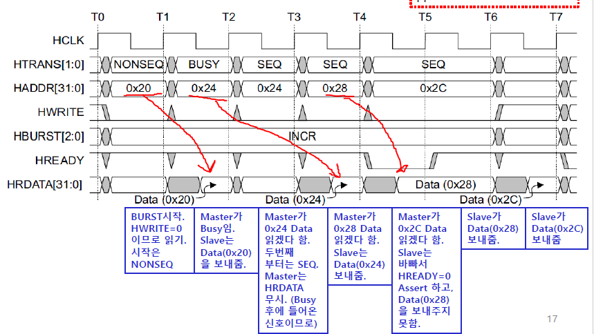
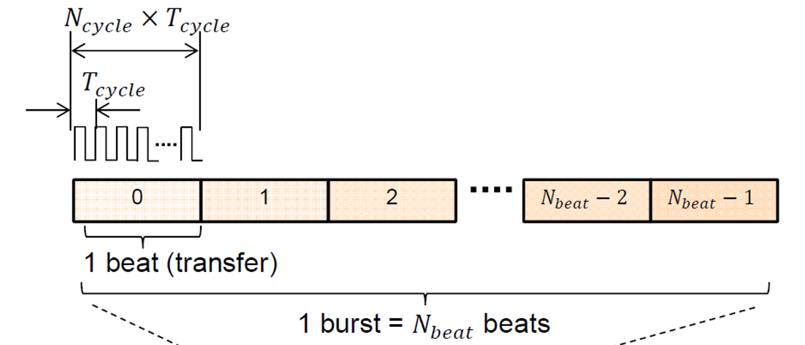

# 기말고사 정리
# On Chip Interconnect Architectures
## Bus
* 
* 
* 
* 다양한 컴퍼넌트들이, SoC에 있다.
* 이것들이 데이터를 주고 받을때 필요한 것이 Bus이다.

## Bus의 중요성
* 
* 위 차트는 단위면적당 와이어의 길이
* 이로 인해 전력소모가 증가
* 
* Technology scaling 에 따라서 logic gate delay 는 줄어들지만, wire delay 는 늘어남으로 인해 , on chip communication 이 점차 중요
* 예전에는 코어에 방점을 뒀다면 **요즘은 커뮤니케이션 구조 설계가 중요**

## on-chip communication?

* Processor-memory (load/store)
* processor-IO
* DMA-memory
* 등,,,이런걸 위해서는 BUS를 거쳐야함.

## Bus Based Architectures
* 
* 버스구조는 SoC에서 가장 간단하고 널리 사용되는 interconnection networks
* Sharedbus는 가장 기본적임.
* Shared Bus는 한번에 하나의 master 만 사용가능
* Sharedbus에서는 예를 들어 Cpu에서 mem으로 데이터를 옮길때는 다른 컴퍼넌트들은 사용불가.
* 즉, CPU-mem 통신간, DSP에서 IO접근 불가 (DSP에서 mem도 접근 불가)

## On Chip Communication 구조의 발전
* 
* Shared Bus: 한번에 하나의 master 가 하나의 slave 사용
  1. 진짜, 우리가 타고다니는 버스가 한대라고 생각하면 됨.
  2. 다만, 중간 정류장에서 못태우고 못 내릴뿐...
* Hierarchical Bus: 한번에 두 개 이상의 master 가 동시에 사용
  1. Shared Bus에서 버스가 한대 뿐이라서 불편했음
  2. 버스를 분리해서 2대 이상 쓰겠다 이말이야
  3. 기준은 빠른 버스(CPU,DSP...)와 느린 버스(IO)
  4. BUS끼리 연결은 브릿지를 사용함
* Bus Matrix: 한 번에 N 개의 master 가 동시에 사용
  1. Zynq에서 사용함.
  2. **동시**에 여러 master가 데이터를 보낼 수 있음
* Network on Chip: 칩 안에서 컴퓨터 네트워크처럼 라우터를 이용한 통신

## Communication Time

* 데이터를 주고 받을때는 데이터가 사이즈가 있다.
* beat(transfer)는 한번에 전달하는 데이터 덩어리
  1. 한 clk에 한 beat를 보낼 수 있음.
  2. But, 여러 clk에 쪼개서 보낼 수 있음.
  3. 몇 CLK에 보내겠냐가 $N_{cycle}$임. (CLK주기는 $T_{cycle}$)
  4. 즉, 한 Beat 보내는데 걸리는 시간은 $N_{cycle} \times T_{cycle}$
* Burst는 N beats로 구성됨.
  1. Bus에서 마스터에서 스레이브로 한번에 하나의 Burst 만 보낼 수 있음.
  2. 한 burst 보냈으면 해당 통신(master-slave 간)의 권한을 반납해야함
  3. 그래서 burst와 burst사이에 시간이 있음
  4. 즉, 한 Burst보내는데 걸리는 시간은 $N_{Beat} \times N_{cycle} \times T_{cycle}$
* 이러한 Burst의 모임이 trabsaction
  1. 즉, 한 trabsaction보내는데 걸리는 시간은 $T_{trans} = N_{Burst} \times N_{Beat} \times N_{cycle} \times T_{cycle}$

## Master/Slave
* 데이터를 발/수신하는 역활로 Master/Slave가 결정되는게 아님.
* Master : 데이터를 수/발신을 시작하는 요소
* Slave : Master가 통신을 시작하면 종속되어 통신
* 
* DMA : 마스터가 될 수 도 있고 슬레이브가 될 수 도 있다.
  1. CPU로 부터 권한을 가져와서 데이터 RW를 대신 수행
  2. DMA가 mem에 데이터를 주도적으로 읽고쓰기를 할 수 있다.
     * 예를들어, 이런식으로 CPU가 명령을 내리면 DMA는 수행한다.
     1. mem 0~100 주소까지의 data를 1000~1100으로 옮겨 적어!
     2. 그럼 DMA는 수행한다.
* 
* Arbiter : Master에 Bus를 사용하는 권한을 주는 요소
  1. 마스터가 여러개면 통신을 원하는 마스터가 아비터에게 권한 요청
  2. 그럼 아비터가 승락 후 통신
* Decoder : 어떤 슬레이브의 데이터를 R/W를 원하는지 결정
* Bridge : 버스가 여러개일시 버스와 버스를 연결
  1. 만약 위 그림에서 Bus1 좌측에 위치한 Processor가 Bus2 우측에 위치한 mem3와 통신을 원한다
  2. Bus1에서 Bus2를 연결해야한다.
  3. 이 연결을 주관하는 것이 브릿지

## 버스 파라미터
* Topology : 버스에 연결된 컴퍼넌트들을 어떻게 연결할지
* Protocol : 데이터를 어떻게 전달할지
* 
* 토폴로지를 정의하면 어떤식으로 wiring할지 결정할 수 있음
* 프로토콜을 정의하면 '우선순위', 'Burst의 Beat 사이즈' 등을 결정할 수 있음.

### Bus Parameters: Topologies
* 
* 버스의 갯수에 따라서 어떻게 Topolgy를 구성할지 달라짐.
* 그냥 Bus를 묶을때 빠른애는 빠른애들끼리, 느린애들은 느린애들끼리 묶어야한다~
* AXI는 Crossbar bus, AHB는 Hierachical bus

### Bus Parameter: Protocol
#### Arbiter
* 
* 여러의 마스터에게 동시에 요청을 왔을때, 누구에게 권한 (Grant)를 줄것인가 결정
* 방법은 2개가 있다.
  1. Round robin : 여러 마스터가 동일한 우선순위를 가질때
     1. 
     2. Ringcounter : 첫클럭에선 1, 2번째 클럭에선 2...
     3. 쨋든 Ringcounter Sig와 권한요청 Sig를 AND연산을 해서 결정
     4. 즉, 권한허가를 순차적으로~
  2. Fixed priority : 서로 다른 우선순위를 가질떄
     1. 

## 물리적 Bus 구조
* **off-chip Bus : on-board**
  * 
  * Tri-Buffer를 사용하여 구성
* **on-chip Bus : SoC**
  * 
  * MUX 기반

# AMBA AHB
## AMBA(**A**dvanced **M**icrocontroller **B**us **A**rchitecture) Interface
* ARM에서 개발 한 on-chip bus architecture
* ARM 을 SoC 의 프로세서 로 채택 한다면, ARM 의 성능을 최대화 하기 위해 AMBA 버스를 이용
* 각종 IP들이 AMBA를 사용한다면 통합하기 편함

## AMBA 표준의 발전
* 
* **AHB : Advanced High Performance Bus 고속**
  * AHB와 AHB-Lite는 RW과정 동일
  * 다만, Lite가 Single master만 지원 -> Layer의 개념으로 분리
* APB: Advanced Peripheral Bus 저속
* **AXI : Advanced eXtensible Interface ( 저속 고속 ), 최신 AMBA 인터페이스**
* ASB: Advanced System Bus ( 현재는 거의 쓰이지 않음)

## AMBA AHB Interface
* 
* UART, TIM, IO 는 빠른 속도가 필요하지 않기에 저속 인터페이스인 APB
* ARM, DMA, 광대역 외부 mem 인터페이스는 속도가 필요하기에 AHB
* Bus가 2개이기에 Bridge로 묶음
  * 모든 장치들이 AHB 에만 연결되어 있다면 , 고속 장치가 저속장치에게 데이터를 요구한 후, 응답을 받을 때까지 Bus 가 놀고 있어야 함.
  * 효율성을 높일 수 있다

## AMBA AHB특징 : 암기 ㄴㄴ
* 다중 버스 마스터
* 주소와 데이터 버스가 분리
* R/W가 버스를 다로 씀
* **Burst전송이 가능함**
* 파이프라인 오퍼레이션
* MUX기반 bus

## Bus Interconnection in AMBA AHB
* 
* Master와 Slave는 각자 아래의 bus를 가지고 있다
  1. 주소 버스
  2. Write 버스
  3. Read 버스
* Arbiter는 MUX에 HMASTER 신호를 보내 master와 slave를 선택한다
* Decoder는 MUX에 신호를 줘 Slave를 selection한다

## Arbiter in AMBA AHB
* 
* MASTER는 Arbiter에게 요청신호를 날림
* Arbiter는 HGRANT_M1, M2, M3 중 하나만 1 로 설정 : master에게 전송
* HMASTER SIG를 MUX에 보내 주소버스를 선택하여 broadcast
* 그 다음 클럭에에선, HMASTER SIG를 또 다른 MUX에 보내 write data버스를 선택하여 broadcast

## Decoder in AMBA AHB
* 
* Arbiter에서 보낸 HMASTER SIG를 MUX가 수신
* MUX는 Slaber와 Decoder에 HADDR(주소) Bus broadcast
* Decoder 는 HADDR 을 보고 , HSEL_S1, S2, S3 중 하나만 1 로 설정
* Read 의 경우 , HSEL 신호를 홀드 후 , 다음 phase 에 Read Data Bus (HRDATA) 결정을 위한 MUX 신호로 사용 (Slide8 의 가장 아래 MUX)

## Write in AMBA3 AHB Lite
* 
* HWRITE ‘1’: write operation
* Master 는 HADDR 로 address 를 보낸 후 , 다음 cycle 에 HWDATA 로 data 를 보냄
* 
* A주소에 Data 를 쓰겠다고 요청함 (HWRITE=1)
* Data(A)를 써야하는데 Slave 가 준비되어 있지않아서 (HREADY=‘0')못씀 Data Phase가 연장됨 .
* HREADY=‘1’이 되면서 Data(A)가 써 짐
  
## AMBA AXI
* 
* 통신, 동영상 스트리밍, AI -> 대용량 데이터가 리얼타임으로 처리되어야함
* 기존의 AHB로는 무리가 있었다 -> AXI의 개발 배경
* 이런 스트리밍 데이터는 Burst전송이 유리 -> Burst에 효율적인 구조 : 시작 주소만 보내면됨
  * 
    * AHB는 Beat들의 주소를 다 적어주면서 Burst를 날림
    1. A라는 주소를 주고 다음 클럭에서 A 데이터 작성
    2. B라는 주소를 주고 다음 클럭에서 B 데이터 읽음
    3. 만약 HREADY=0이 길어지면 Data B를 못읽음 -> Data C 작성도 딜레이됨
    4. 즉, 슬레이브가 느리면 다음 Task를 수행 못하고 버스가 정체됨.
    5. 왜냐면, 전송이 완료되지 않으면 Bus 사용권한을 반납하지 않고 독점하기 때문에 -> 시스템이 느려짐
  * 근데 AXI는 시작 주소만 적어주고 데이터 날리게 개선함
  * 인터페이스는 간단해졌으나, 이거를 내부적으로 돌아야기 떄문에 컨트롤 신호와 회로가 커짐 
* |AXI4|AXI4-Lite|AXI4-stream|
  |----|---------|-----------|
  |고성능|저성능| 스트리밍 : 고성능이긴한데 복잡한거 다 뺌|
* 
  AMBA AXI는 Crossbar bus

## AHB VS AXI
* 채널 도입 : 5개 채널
* Out of order transaction 도입
* Burst 기반 Data 전송
  * AHB
    * Burst 전송시 master가 address 전부 생성
    * 
    * Single (or Hierachial) Bus : 1 MUX당 Bus 1개
    * Shared Bus -> Bus를 사용하는 Master와 Slave는 각 1개
  * AXI
    * Burst 전송시 master는 start address만 생성 후속 주소는 Slave가
    * 
    * Crossbar bus : 1 Mux 당 Slave 1개
    * 여러개의 master와 slave가 bus를 동시에 사용하는 것이 가능함
  * 주소채널의 data량 현격히 줄어듦

## 5 Channels in AMBA AXI
* 
* 
* Global : ACLK, ARESTn
* (AR) Read address channel : Master (Source) -> Slave (Destination)
  * ARID, ARLEN, ARSIZE, ARBURST , ARLOCK , ARCACHE, ARPROT, ARVALID, 
  * ARADDR : 읽을 주소
  * ARREADY : Master한테 수신할 준비가 되었다는 신호
    * 얘 뺴고 모든 신호를 Source에서 보냄
    * ARREADY SIG는 Slave (Destinaton)에서 Master(Source)를 넘김 : 방향 반대

* (R) Read data channel : Slave (Source) -> Master (Destination)
  * RID, RLAST, RSTRB, RVALID, RREADY
  * RDATA : 실제로 읽을 데이터가 여기를 통해 넘어옴
  
* (AW) Write address channel : Master (Source) -> Slave (Destination)
  * AWID, AWLEN, AWSIZE, AWBURST, AWLOCK, AWCACHE, AWPROT, AWVALID, AWREADY
  * AWADDR : 쓸 주소
  
* (W) Write data channel : Master (Source) -> Slave (Destination)
  * WID , WLAST, WSTRB, WVALID, WREADY
  * WDATA : 실제로 쓸 데이터
  
* (B) Write response channel : Slave (Source) -> Master (Destination)
  * Salve가 master에게 잘 받아적었다고 응답해주는 신호
  * BID, BRESP, BVALID, BREADY

## Handshack Mechanism in AXI
* 
* 모든 채널에는 아래의 신호가 있다
  * ID : xID
  * INFO
    * xADDR
    * XDATA
    * xRESP
  * Valid : xVALID
    * source 에서 data 와 control 신호들이 유효함 을 알려줌
    * master가 보내는 신호임 : 신호가 유효한지를 master가 말해주는거임.
    * 예를들어, data를 보내는 중에는 Valid를 0으로 둠으로써 아직 데이터가 유효하지 않다라는 것을 말하는 것임.
    * 다 보내면 valid를 1로 둠으로써 slave에게 data가 유효함을 말해줌
  * READY : xREADY
    * source 에서 data 와 control 신호들이 유효함 을 알려줌

* 예를 들어 AR채널을 살펴보자
* AR채널의 목적은 Master가 Slave에게 주소(ARADDR)를 잘 전달하는게 목적이다.
* 항상 잘 전달해야하냐? -> 아니다, 특정한 시점에 잘 전달해야한다.
  * 
    Valid && READY가 1일때, 정보가 전달된다.
* 즉, 각 채널의 (xVALID && xRAEDY) = 1 일때, INFO가 전달이 된다.

## Burst Transfer in AMBA AXI
* AHB : 매번 주소를 생성해야한다
  * 
  * 
* AXI : Start address만 master가 생성하고 나머지는 Salve가 생성
  * 
  * **Read**
    * 
  * **Overlapped**
    * 
  * **Write**
    * 

## Out of Order Transaction in AMBA AXI
* 
* In-Order
  * 앞전 전송이 끝나기전에 뒤의 Burst전송의 ADDR 보낼 수 있음 -> Overlapped
  * 순서대로 Burst 전송이 됨
* Out-of-order
  * 순서가 지 마음대로 : AXI에서는 이게 가능함
  * Burst의 순서는 바뀌어도 Burst 내의 순서는 안바뀜
* Interleave
  * 같은 Busrst 내의 순서는 안바뀌었음
  * 하지만 전부 섞여버림...어떻게 구분함...?
    * 
    * 각 채널의 ID를 발생시키기에 어느 주소의 신호인지 구분이 가능함.
    * 그림상에는 색으로 표시되었지만, 실제로는 WID Wire에서 ID를 보여줌

## Control Signals in AMBA AXI Burst Size
* 
* Burst 전송의 Size에 대한 Signal
  * 
* Transfer(=Beat) 크기에 대한 Signal
  * 

## Three AXI Interfaces in AMBA4 AXI
* 
* |Interface      |Features                                            |Usage|
  |---------------|----------------------------------------------------|-----|
  |Full (AXI4)    | 5개 채널을 지원, Burst 전송 지원                     | High performance / Burst|
  |Lite(AXI4 Lite)| 5개 채널을 지원, Burst 전송 미지원(ADDR하나 Data하나) | 주변장치 Config 할때 / No burst|
  |Streaming (AXI4 Stream)|채널 1개만 있음, Write data channel          | Burst 특화 / ADDR이 없기에 Point 2 Point bus|

## Full AXI4 Interface (=Memory Mapped AXI)
* 
* 5개 채널을 지원
* Burst 전송 지원
  * ADDR 하나당 Data 줄줄이
  
## AXI4 Lite Interface
* 
* 5개 채널을 지원
* Burst 전송 미지원
  * ADDR 하나당 Data 하나

## AXI4 Stream Interface
* 
* AXI-FULL같은 경우 Busrt 길이 제한 있음
* But, AXI4 Stream는 Burst **길이 제한 없음**

## Nine AXI Ports in ZYNQ
* 
* 화살표의 촉 부분이 Slave
* 대부분 FPGA(PL/진한 그레이)가 Master
* PS가 master인 경우는 FPGA(PL)의 모듈을 설정해야할때...
* 
* GP / HP/ ACP 모두 Full AXI
  * AXI-Lite와 연결될 경우 AXI interconnect core가 변환해 줌

### AXI_GP (Genral perofomance)
* 32bit 2EA : Slave interface (PS 기준)
  * FPAG(PL)에서 PS의 주변장치와 통신을 할 때 사용 
* 32bit 2EA : Master interface (PS 기준)
  * Ethernet data같이 좀 빠른 데이터가 PL로 흘러감.
  * PL의 레지스터를 설정하는데 사용됨

### AXI_HP (High perofomance)
* 64bit 4EA : Slave interface (PS 기준)
  * 광대역 (고성능) : 한번에 여러개의 데이터 보낼 수 있음
  * PL에서 DRAM con을 거쳐 외부 mem(DRAM : 대용량 데이터)으로 접근

### AXI_ACP
* 64bit 1EA : Slave interface (PS 기준)
  * PL에서 캐쉬로 들어감.

# Direct Memory Access (DMA)
## CPU를 이용한 Mem to Mem 데이터 전송
* 
* Mem1의 주소 0x100~0x200에 있는 데이터를 Mem2의 주소 0x200~0x300으로 옮겨야 할 때,
* CPU가 LOAD instruction을 통해 memory1의 data를 읽어서 Register에 저장함.
* 즉,CPU는 한줄씩 읽어서 보낸다.
* DMA는 Burst 전송을 지원한다

## DMAC을 이용한 Mem to Mem 데이터 전송
* 
* Direct Memory Access (DMA): CPU의 관여 없이 직접 메모리 간의 데이
터 이동을 수행하는 방법 (Method)
* DMAC (DMA Controller): DMA를 수행하는 모듈 이름. -> PL로 만듬

## Direct Memory Access (DMA)
* 
* CPU로부터 권한을 받아 독립적으로 실행
* Memory to memory
* Memory to IO (stream), IO (stream) to memory
* IO (stream) to IO (stream)
* **Memory 영역**
  * Baseline DMA: contiguous
    * 소스의 메모리주소가 연속적일떄
  * Scatter gather DMA: non contiguous
    * 소스의 메모리주소가 비연속적일때
* **작동모드**
  * Burst mode: multiple transfer (multipler beats transfer per burst)
    * Burst mode
  * Word mode: single transfer (single beat transfer per burst)
    * Burst 하나당 문자 하나
  
  ## DMAC Registers
  * 
  * CPU가 DMAC을 컨트롤 하기 위한 Register들
    * Source Register : Source의 Start Address를 저장하기 위한 Register.
    * Destination Register: Destination의 Start Address를 저장하기 위한 Register
    * Count Register: Length를 저장하기 위한 Register. Transfer 마다 1씩 줄어듦.
    * Control Register: 전속 시작 명령 Bit, 동작 모드 (Operation Mode) 설정 Bits
  * EXAMPLE
    * 
  
  ## Communication Time
  * CPU (Laod & Store) : ~20 cycles / transfer (Ncycle ~= 20)
  * DMA : 1~ Cycle / transfer
    * 